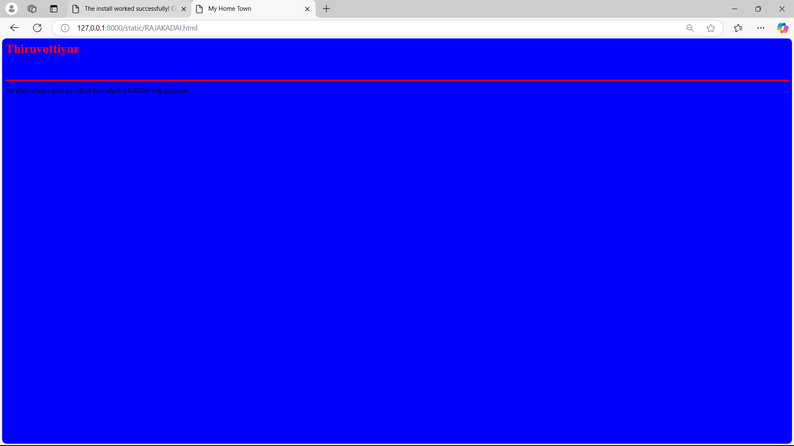
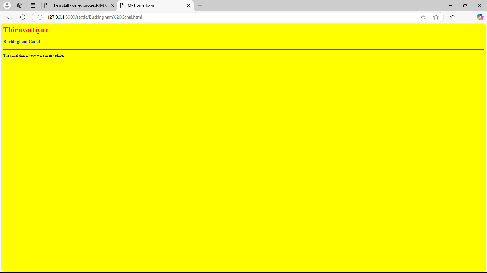

# Ex04 Places Around Me
## Date: 24.11.24

## AIM
To develop a website to display details about the places around my house.

## DESIGN STEPS

### STEP 1
Create a Django admin interface.

### STEP 2
Download your city map from Google.

### STEP 3
Using ```<map>``` tag name the map.

### STEP 4
Create clickable regions in the image using ```<area>``` tag.

### STEP 5
Write HTML programs for all the regions identified.

### STEP 6
Execute the programs and publish them.

## CODE
```
map.html

<html>
<head>
<title>My City</title>
</head>
<body>
<h1 align="center">
<font color="red"><b>Thiruvottiyur</b></font>
</h1>
<h3 align="center">
<font color="blue"><b>SHIVAANI R (24007075)</b></font>
</h3>
<center>

<map name="image-map">
    <area target="" alt="" title="" href="Thiruvottiyur Beach.html" coords="1533,187,1431,221" shape="rect">
    <area target="" alt="" title="" href="Akash Hospital.html" coords="1265,206,54" shape="circle">
    <area target="" alt="" title="" href="Tamiladu Petroproducts Limited.html" coords="407,42,607,44,566,93,500,93" shape="poly">
    <area target="" alt="" title="" href="RAJAKADAI.html" coords="1203,527,1379,511,1313,552" shape="poly">
    <area target="" alt="" title="" href="Buckingham Canal.html" coords="836,511,46" shape="circle">
</map>
</center>
</body>
</html>

Akash Hospital.html

<html>
    <head>
        <title>My Home Town</title>

    </head>
    <body bgcolor="pink">
        <h1 allign="center">
            <font color="red"> <b> Thiruvottiyur</b></font>

        </h1>
        <h3 allign="center">
            <font color="blue"> <b>Akash Hospital</b></font>
        </h3>
        <hr size="3" color="red">
        <p allign="justify">
            <font face="Georgia" size="5"></font>
        The famous hospital which as a good memory.
            </p>
            

    </body>
</html>

Buckingham Canal.html

<html>
    <head>
        <title>My Home Town</title>

    </head>
    <body bgcolor="pink">
        <h1 allign="center">
            <font color="red"> <b> Thiruvottiyur</b></font>

        </h1>
        <h3 allign="center">
            <font color="blue"> <b>Buckingham Canal</b></font>
        </h3>
        <hr size="3" color="red">
        <p allign="justify">
            <font face="Georgia" size="5"></font>
       The canal that is very wide in my place.
            </p>
            

    </body>
</html>

RAJAKADAI.html

<html>
    <head>
        <title>My Home Town</title>

    </head>
    <body bgcolor="pink">
        <h1 allign="center">
            <font color="red"> <b> Thiruvottiyur</b></font>

        </h1>
        <h3 allign="center">
            <font color="blue"> <b>RAJAKADAI</b></font>
        </h3>
        <hr size="3" color="red">
        <p allign="justify">
            <font face="Georgia" size="5"></font>
        The place where i spent my school days which is fullfilled with memories
            </p>
            

    </body>
</html>

Tamiladu Petroproducts Limited.html

<html>
    <head>
        <title>My Home Town</title>

    </head>
    <body bgcolor="pink">
        <h1 allign="center">
            <font color="red"> <b> Thiruvottiyur</b></font>

        </h1>
        <h3 allign="center">
            <font color="blue"> <b>Tamiladu Petroproducts Limited</b></font>
        </h3>
        <hr size="3" color="red">
        <p allign="justify">
            <font face="Georgia" size="5"></font>
        The very famous company near me which is involved in the production of petrol and its variations
            </p>
            

    </body>
</html>

Thiruvottiyur Beach.html

<html>
    <head>
        <title>My Home Town</title>

    </head>
    <body bgcolor="pink">
        <h1 allign="center">
            <font color="red"> <b> Thiruvottiyur</b></font>

        </h1>
        <h3 allign="center">
            <font color="blue"> <b>Thiruvottiyur Beach</b></font>
        </h3>
        <hr size="3" color="red">
        <p allign="justify">
            <font face="Georgia" size="5"></font>
        The place that makes me relax and stress releif.the sound of waves makes the heart fullfilled.
            </p>
            

    </body>
</html>

```

## OUTPUT






## RESULT
The program for implementing image maps using HTML is executed successfully.
